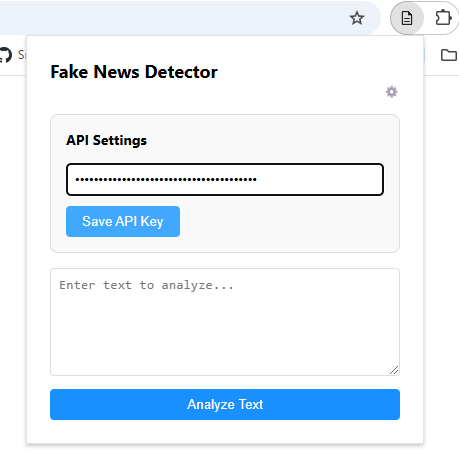

# Fake News & Clickbait Detection Chrome Extension

## Overview

This Chrome extension helps users detect fake news and clickbait articles on Facebook primarily and others. When hovering over a link to an article, the extension displays a warning badge indicating whether the article is clickbait or not. If the user clicks on the badge, additional information is provided. The extension uses Google's Gemini AI for analysis.

## Features

- **Fake News Detection**: Determines whether an article contains false or misleading information.
- **Clickbait Detection**: Flags articles with misleading or exaggerated headlines.
- **Interactive UI**: Displays a clickable pill-like badge with a warning message when hovering over links.
- **Detailed Analysis**: Clicking the badge provides reasoning and an article summary.

## Setup Instructions

### 1. Clone the Repository
Download as zip and then extract the repository or clone it through the cli:

```sh
git clone https://github.com/vullnetgervalla/fake-news-detector.git
```

### 2. Add the extension to Chrome
1. Visit [chrome://extensions](chrome://extensions).
2. Turn on developer mode.
3. Click on the "Load unpacked" button and select the `extension` directory of this repository.

### 3. Obtain Google Gemini API Key

1. Go to [Google AI Studio](https://aistudio.google.com/apikey).
2. Generate a new API key and copy it.

### 4. Add the API Key to the extension


## How it works

### Detecting Clickbait
When a user hovers over a Facebook post containing a link:
1. The extension extracts the html elements of the post and finds the `title` and `url` of the article. 
1. The extension extracts then fetches the article through a CORS proxy ([codetabs](https://codetabs.com/cors-proxy/cors-proxy.html) in this case) and parses the content using [readability.js](https://github.com/mozilla/readability).
2. A prompt is created comparing the article's title and content (All the prompts will be provided at the end of this file).
3. Googles Gemini AI processes the data and returns a JSON response with:
    - clickbait: true or false
    - reason: Explanation in the article's detected language
    - summary: Summarized version of the article
4. A expandable badge appears with the results.

||||
|--------------|--------------|--------------|
|  |  |  |
||||

### Detecting Fake News
1. An article can be analyzed for fake news directly from the `Check for Fake News` button in the clickbait badge popover.
2. Using the already fetched and parsed article a prompt is created and sent to Gemini.
3. Googles Gemini AI processes the data and returns a JSON response with:
    - veracity: Fake News, Inconclusive, or Real News
    - reasoning: Explanation in the article's detected language
    - summary: Summarized version of the article
4. The results are appended to the popover.

||||
|--------------|--------------|--------------|
|  |  |  |
||||

### Not limited to facebook
This extension is not limited to facebook but works with potentially all news websites that post articles. Alternatively you can enter text in the extension popover to manually check if the text is reliable or not. Below are some examples:
|||
|--------------|--------------|
|  | |
|||


## ⚠️ AI Limitations & Bias Warning  

This extension uses Google's Gemini AI to analyze articles for fake news and clickbait detection. While AI can be a powerful tool, it has limitations:  

- **Hallucinations**: The AI may generate incorrect or misleading information that is not present in the original article. Always verify critical details from multiple sources.  
- **Bias**: Gemini AI is developed by Google and may reflect biases aligned with its training data and moderation policies. Certain viewpoints may be favored or suppressed.  
- **False Positives/Negatives**: No AI model is 100% accurate. Articles flagged as fake or clickbait might be legitimate, and some deceptive content may go undetected.  

**Use this extension as a guide, not an absolute truth detector.** Critical thinking and independent research are essential when evaluating news and online content.  

## 🔍 Alternatives & Other Approaches  

While this extension currently uses **Google’s Gemini AI** for detecting fake news and clickbait, there are other approaches and tools that can be considered for fact-checking and content analysis:  

### 1. Perplexity AI  
[Perplexity AI](https://www.perplexity.ai/) is an alternative AI-powered search engine that provides real-time web-based answers by pulling data from multiple sources. Unlike Gemini, which may be limited by training data and content restrictions, Perplexity actively queries the web, offering broader perspectives.  

### 2. Manual Fact-Checking Sources
For higher accuracy, combining AI with human-reviewed sources is ideal. Trusted platforms like:  
- **[Snopes](https://www.snopes.com/)** (fact-checking site)  
- **[PolitiFact](https://www.politifact.com/)** (political claim verification)  
- **[Reuters Fact Check](https://www.reuters.com/fact-check/)** (news verification)


## Prompts

### 1. Prompt used for detecting clickbait:
```
For languages other than English, keep *all* parts of the response (the 'reason', 'summary', and any other text) in that detected language. For example, if the article is in Albanian, the 'reason' and 'summary' should be in Albanian.
Respond *only* with a JSON object, for new lines use backslash n and don't leave empty lines as it doesn't parse as a JSON. The JSON object *must* contain these three keys: 'clickbait', 'reason', and 'summary'.  Do not include any other text outside the JSON object.
The 'clickbait' value should be a boolean (true or false). The 'reason' value should explain *specifically* why the title is or isn't clickbait, referencing concrete examples from the title and article.  The 'summary' value should be a concise summary of the article's main points. *Both the 'reason' and 'summary' must be in the same language as the article.*
Be conservative in labeling titles as clickbait.  A title that is slightly sensational or intriguing is not necessarily clickbait. Clickbait relies on exaggeration, misleading information, or withholding key information to manipulate clicks.  A good title that accurately reflects the article's content, even if it's attention-grabbing, is *not* clickbait.
Is this title: "${title}", clickbait for this article: ${article}?
```

### 2. Prompt used for detecting fake news:
```
For languages other than English, keep *all* parts of the response (the 'veracity', 'reasoning' and 'summary') in that detected language. For example, if the article is in Albanian, the 'reason' and 'summary' should be in Albanian.
Respond *only* with a JSON object, for new lines use backslash n and don't leave empty lines as it doesn't parse as a JSON. The JSON object *must* contain these four keys: 'veracity', 'reasoning' and 'summary'. Do not include any other text outside the JSON object.
The 'veracity' value should be one of the following strings: "Fake News", "Inconclusive", or "Real News".
The 'reasoning' value should explain *specifically* why the text is classified as such, referencing concrete examples from the text and the search results. Clearly state what information was verified and how. Explain any discrepancies or inconsistencies found. If classified as "Inconclusive," explain what further information would be needed to make a definitive judgment. If classified as "Real News" or "Fake News," provide a concise explanation of the evidence supporting that conclusion. *This explanation must be in the same language as the provided text.*
The 'summary' value should be a concise summary of the text's main points. *This summary should be in the same language as the provided text.*
Be conservative in labeling text as "Fake News." Misinformation, biased reporting, or lack of context does not automatically equate to "Fake News." "Fake News" implies deliberate fabrication or significant distortion of facts. If the text presents a particular viewpoint or interpretation of events, acknowledge that but focus on the factual claims within the text.
Consider the source of the text. Is it from a known and reputable news organization, a blog, a social media post, or an anonymous source? This context is important in evaluating the credibility of the information.
Perform a thorough search using relevant keywords from the text to verify the claims made. Compare information from multiple sources to identify any discrepancies or inconsistencies. Prioritize information from reputable and authoritative sources.
The article is: "${articleContent}"?
```
